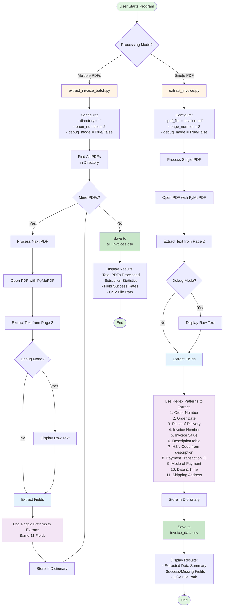

```mermaid
flowchart TD
    Start([User Starts Program]) --> Choice{Processing Mode?}
    
    Choice -->|Single PDF| SingleScript[extract_invoice.py]
    Choice -->|Multiple PDFs| BatchScript[extract_invoice_batch.py]
    
    SingleScript --> ConfigSingle[Configure:<br/>- pdf_file = 'invoice.pdf'<br/>- page_number = 2<br/>- debug_mode = True/False]
    BatchScript --> ConfigBatch[Configure:<br/>- directory = '.'<br/>- page_number = 2<br/>- debug_mode = True/False]
    
    ConfigSingle --> ProcessSingle[Process Single PDF]
    ConfigBatch --> FindPDFs[Find All PDFs<br/>in Directory]
    
    FindPDFs --> LoopStart{More PDFs?}
    LoopStart -->|Yes| ProcessPDF[Process Next PDF]
    LoopStart -->|No| SaveBatch[Save to<br/>all_invoices.csv]
    
    ProcessSingle --> OpenPDF1[Open PDF with PyMuPDF]
    ProcessPDF --> OpenPDF2[Open PDF with PyMuPDF]
    
    OpenPDF1 --> ExtractText1[Extract Text from Page 2]
    OpenPDF2 --> ExtractText2[Extract Text from Page 2]
    
    ExtractText1 --> Debug1{Debug Mode?}
    ExtractText2 --> Debug2{Debug Mode?}
    
    Debug1 -->|Yes| ShowRaw1[Display Raw Text]
    Debug1 -->|No| Extract1
    Debug2 -->|Yes| ShowRaw2[Display Raw Text]
    Debug2 -->|No| Extract2
    
    ShowRaw1 --> Extract1[Extract Fields]
    ShowRaw2 --> Extract2[Extract Fields]
    
    Extract1 --> Fields1[Use Regex Patterns to Extract:<br/>1. Order Number<br/>2. Order Date<br/>3. Place of Delivery<br/>4. Invoice Number<br/>5. Invoice Value<br/>6. Description table<br/>7. HSN Code from description<br/>8. Payment Transaction ID<br/>9. Mode of Payment<br/>10. Date & Time<br/>11. Shipping Address]
    
    Extract2 --> Fields2[Use Regex Patterns to Extract:<br/>Same 11 Fields]
    
    Fields1 --> Store1[Store in Dictionary]
    Fields2 --> Store2[Store in Dictionary]
    
    Store1 --> SaveSingle[Save to<br/>invoice_data.csv]
    Store2 --> LoopStart
    
    SaveSingle --> DisplaySingle[Display Results:<br/>- Extracted Data Summary<br/>- Success/Missing Fields<br/>- CSV File Path]
    
    SaveBatch --> DisplayBatch[Display Results:<br/>- Total PDFs Processed<br/>- Extraction Statistics<br/>- Field Success Rates<br/>- CSV File Path]
    
    DisplaySingle --> End1([End])
    DisplayBatch --> End2([End])
    
    style Start fill:#e1f5e1
    style End1 fill:#e1f5e1
    style End2 fill:#e1f5e1
    style SingleScript fill:#fff4e6
    style BatchScript fill:#fff4e6
    style Extract1 fill:#e3f2fd
    style Extract2 fill:#e3f2fd
    style Fields1 fill:#f3e5f5
    style Fields2 fill:#f3e5f5
    style SaveSingle fill:#c8e6c9
    style SaveBatch fill:#c8e6c9
```
